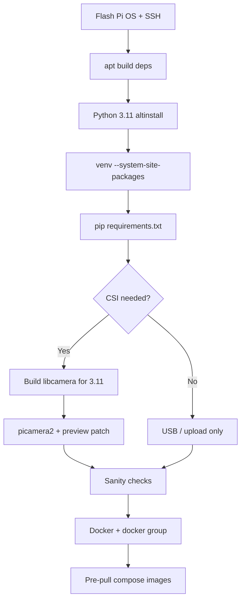

# 0. Image preparation

We ship a **prepared `.img`** for Project One. It already includes:

- Python **3.11** at `/usr/local/bin/python3.11` and venv `~/.venv`
- MediaPipe, YOLO (Ultralytics), Gradio, OpenCV in that venv
- CSI stack (`libcamera` + Picamera2) aligned with 3.11
- **Docker Engine**, user `student` in the `docker` group
- Pre-pulled images: `postgres:16-alpine`, `dpage/pgadmin4:latest`, `python:3.11-slim-bookworm`

**Flash the prepared image** and go to [2_Kickoff.md](2_Kickoff.md). Use **this document** only when you rebuild the golden image from scratch or fix a broken stack after an upgrade.

**App code:** [`RPi/`](../RPi/) — `python app.py` after setup.

---

## Why Python 3.11

| Topic              | Situation on recent Pi OS                                                   |
| ------------------ | --------------------------------------------------------------------------- |
| Default Python     | Often **3.13** (`python3 --version`)                                        |
| MediaPipe          | Pip wheels for Pi target **3.11 / 3.12**, not 3.13                          |
| YOLO (Ultralytics) | Same venv as MediaPipe → use **3.11**                                       |
| CSI camera         | **`libcamera` + `picamera2`** built for the **same** Python you run         |
| USB camera         | OpenCV + V4L2; [`list_cameras.py`](../RPi/list_cameras.py) for stable names |

---

## Python paths (read first)

| What               | Path                              | Version                           |
| ------------------ | --------------------------------- | --------------------------------- |
| OS default         | `/usr/bin/python3` → `python3.13` | **3.13** — do not use for the app |
| App / MediaPipe    | `/usr/local/bin/python3.11`       | **3.11.15** (`make altinstall`)   |
| Virtual env        | `/home/student/.venv`             | Created from 3.11.15              |
| Active interpreter | `~/.venv/bin/python`              | 3.11.15 when venv is active       |

Always run the kickoff app with the venv (`which python` → 3.11.15). Add to `~/.bashrc`:

```bash
# enable venv
source ~/.venv/bin/activate
```

VS Code Remote-SSH interpreter: **`/home/student/.venv/bin/python`**.

---

## Overview



**Time:** Python compile + libcamera build can take **1–3+ hours** on a Pi 4/5.

---

## Before you start

| Item       | Recommendation                                              |
| ---------- | ----------------------------------------------------------- |
| SD card    | ≥ 16 GB free (32 GB safer for builds)                       |
| Power      | Official PSU                                                |
| Network    | Ethernet or Wi‑Fi for `apt` / `git` / `pip` / `docker pull` |
| User       | `student` with `sudo`                                       |
| Interfaces | Enable SSH, I²C, camera in `raspi-config`                   |

```bash
df -h /
```

### Optional: flash latest Raspberry Pi OS (DIY only)

If you are **not** starting from our prepared `.img`:

1. Use **Raspberry Pi Imager** → latest Raspberry Pi OS.
2. Set hostname, Howest Wi‑Fi, locale in Imager **before** write (or configure after first boot).
3. Boot, enable SSH / camera / I²C, then continue with Step 1 below.

---

## Step 1 — System packages

```bash
sudo apt update
sudo apt full-upgrade -y   # optional; can break versions — skip on a known-good image

sudo apt install -y \
  build-essential git curl wget \
  tk-dev libncurses5-dev libncursesw5-dev libreadline6-dev \
  libdb5.3-dev libgdbm-dev libsqlite3-dev libssl-dev libbz2-dev \
  libexpat1-dev liblzma-dev zlib1g-dev libffi-dev \
  swig python3-dev pkg-config \
  meson ninja-build cmake \
  pybind11-dev \
  libglib2.0-dev libgstreamer-plugins-base1.0-dev \
  libboost-dev libgnutls28-dev openssl libtiff-dev \
  libdrm-dev libcap-dev \
  python3-picamera2 python3-libcamera \
  libcamera-dev libcamera-apps libcamera-apps-lite libcamera-utils \
  python3-kms++ libkms++-dev libfmt-dev \
  python3-rpi-lgpio python3-smbus2
```

Enable the camera:

```bash
sudo raspi-config   # Interface Options → Camera → Enable
sudo reboot
```

After reboot:

```bash
rpicam-hello --list-cameras    # CSI
v4l2-ctl --list-devices        # USB
```

GPIO interrupt issues after a kernel upgrade: see [Appendix.md](Appendix.md) (rpi-lgpio).

---

## Step 2 — Install Python 3.11

Do **not** replace `/usr/bin/python3`. Install 3.11 beside it:

```bash
cd /tmp
wget https://www.python.org/ftp/python/3.11.15/Python-3.11.15.tgz
tar xf Python-3.11.15.tgz
cd Python-3.11.15
./configure --enable-optimizations
make -j "$(nproc)"
sudo make altinstall
```

Verify:

```bash
/usr/local/bin/python3.11 --version   # Python 3.11.15
/usr/bin/python3 --version              # 3.13.x — leave unchanged
```

---

## Step 3 — Virtual environment (`~/.venv`)

```bash
/usr/local/bin/python3.11 -m venv --system-site-packages /home/student/.venv
source ~/.venv/bin/activate
which python && python --version
```

Auto-activate on login:

```bash
echo '' >> ~/.bashrc
echo '# enable venv' >> ~/.bashrc
echo 'source ~/.venv/bin/activate' >> ~/.bashrc
source ~/.bashrc
```

Install Python dependencies (clone repo first if needed):

```bash
cd ~/2025-2026-ProjectOne-CTAI-<yourname>/RPi
source ~/.venv/bin/activate
pip install --upgrade pip
pip install --extra-index-url https://download.pytorch.org/whl/cpu -r requirements.txt
```

---

## Step 4 — CSI stack (libcamera + Picamera2)

Skip if you only use **USB / upload**.

### 4.1 Problem

Apt `python3-libcamera` targets **system** Python. The 3.11 venv needs **libcamera bindings built for 3.11**, with the loader using matching `.so` files under `/usr/local`.

### 4.2 Remove conflicting pip copies

```bash
source ~/.venv/bin/activate
pip uninstall -y libcamera picamera2 rpi-libcamera kms 2>/dev/null || true
sudo rm -rf /usr/local/lib/python3.11/site-packages/libcamera* \
            /usr/local/lib/python3.11/site-packages/picamera2*
sudo ldconfig
```

### 4.3 Build libcamera from Raspberry Pi sources

```bash
sudo apt install -y \
  libudev-dev libyaml-dev python3-yaml python3-ply \
  libjpeg-dev libpng-dev libevent-dev libunwind-dev \
  libgtest-dev libdw-dev

mkdir -p ~/bin-fw-py311
ln -sf /usr/local/bin/python3.11 ~/bin-fw-py311/python3
export PATH="$HOME/bin-fw-py311:$PATH"
which python3 && python3 --version

cd /tmp
rm -rf libcamera
git clone https://github.com/raspberrypi/libcamera.git
cd libcamera
git fetch --tags
# Optional: git checkout v0.7.0+rpt20260205

meson setup build \
  --prefix=/usr/local \
  --buildtype=release \
  -Dpycamera=enabled \
  -Dv4l2=enabled \
  -Dcam=disabled \
  -Dlc-compliance=disabled \
  -Dtest=false \
  -Ddocumentation=disabled \
  -Dgstreamer=enabled

ninja -C build
sudo ninja -C build install
sudo ldconfig

echo '/usr/local/lib/aarch64-linux-gnu' | sudo tee /etc/ld.so.conf.d/zzz-local-libcamera.conf
sudo ldconfig

ldd /usr/local/lib/python3.11/site-packages/libcamera/_libcamera*.so | grep libcamera
```

All `libcamera.so` lines should be under **`/usr/local/...`**.

### 4.4 Picamera2 in the venv

```bash
source ~/.venv/bin/activate
pip install -U pip picamera2
python -c "import libcamera; print(libcamera.__file__)"
```

### 4.5 Headless fix (no `pykms`)

`import picamera2` may fail with **`No module named 'pykms'`** because DRM preview loads at import time. Gradio uses **`capture_array()`** — DRM preview is not required.

Edit the venv file shown by:

```bash
python -c "import picamera2, pathlib; print(pathlib.Path(picamera2.__file__).parent / 'previews/__init__.py')"
```

Wrap `DrmPreview` in `try/except ImportError` and set `DrmPreview = NullPreview`.

### CSI notes (what failed / what worked)

| Approach                                     | Result                                  |
| -------------------------------------------- | --------------------------------------- |
| `pip install libcamera`                      | Not a one-shot on Pi                    |
| `rpi-libcamera`                              | Version clash with system libcamera 0.7 |
| Isolated venv + `pip install picamera2` only | `import libcamera` fails                |
| Mixed pip bindings + apt `libcamera.so`      | `undefined symbol` on import            |
| Building `pykms` on Trixie                   | Header mismatch with `rpi-kms`          |

App CSI code: [`RPi/inputs/csi_camera.py`](../RPi/inputs/csi_camera.py).

```bash
python -c "import libcamera; from picamera2 import Picamera2; print('CSI stack OK')"
```

---

## Step 5 — Sanity checks

```bash
cd ~/2025-2026-ProjectOne-CTAI-<yourname>/RPi
source ~/.venv/bin/activate

python -c "import mediapipe as mp; print('MediaPipe OK', mp.__version__)"
python -c "import ultralytics; print('YOLO OK')"
python -c "import gradio; print('Gradio OK')"
python -c "import cv2; print('OpenCV OK')"
python -c "import libcamera; from picamera2 import Picamera2; print('CSI OK')"   # if using CSI

python list_cameras.py
```

Set `camera_device` in [`config.py`](../RPi/config.py) from `list_cameras.py` output.

---

## Step 6 — Quick test run

```bash
cd ~/2025-2026-ProjectOne-CTAI-<yourname>/RPi
python app.py
```

Open `http://<pi-ip>:7860` from your laptop. Browser webcam input needs localhost or HTTPS — see [Appendix.md](Appendix.md).

---

## Step 7 — Docker Engine

Reference: [Install Docker Engine on Debian — convenience script](https://docs.docker.com/engine/install/debian/#install-using-the-convenience-script).

### 7.1 Install

```bash
curl -fsSL https://get.docker.com -o get-docker.sh
sudo sh get-docker.sh
```

Optional dry-run: `sudo sh ./get-docker.sh --dry-run`

Verify:

```bash
sudo systemctl status docker
sudo docker run hello-world
```

If the script fails, use the [apt repository method](https://docs.docker.com/engine/install/debian/#install-using-the-repository).

### 7.2 Run Docker as `student`

```bash
sudo usermod -aG docker student
```

Log out and back in (or reboot). Then:

```bash
docker --version
docker compose version
docker run hello-world
```

`permission denied` means the session has not picked up the `docker` group yet — re-login.

Further hardening: [Linux postinstall](https://docs.docker.com/engine/install/linux-postinstall/).

---

## Step 8 — Pre-pull images for `RPi/api/`

On the golden image, pull once before distributing the `.img`:

```bash
docker pull postgres:16-alpine
docker pull dpage/pgadmin4:latest
docker pull python:3.11-slim-bookworm
```

| Image                       | Role                               |
| --------------------------- | ---------------------------------- |
| `postgres:16-alpine`        | Postgres in `docker-compose.yml`   |
| `dpage/pgadmin4:latest`     | pgAdmin                            |
| `python:3.11-slim-bookworm` | Base for `RPi/api/Dockerfile` only |

The **`ctai-api`** container is **built** per repo (`docker compose up -d --build`), not pulled.

```bash
docker images
```

Kickoff day: [2_Kickoff.md](2_Kickoff.md) Step 4 — copy `.env` and `docker compose up -d --build` only.

---

## Troubleshooting

| Symptom                                  | Likely cause               | What to try                                 |
| ---------------------------------------- | -------------------------- | ------------------------------------------- |
| `No module named 'mediapipe'` on 3.13    | Wrong Python               | `source ~/.venv/bin/activate`               |
| `which python` shows 3.13                | Venv not active            | `/home/student/.venv/bin/python` in VS Code |
| `import libcamera` fails                 | Wrong/mixed bindings       | Rebuild Step 4, fix `ldconfig`              |
| `undefined symbol` on `import libcamera` | `/lib` vs `/usr/local` mix | Remove pip libcamera, rebuild               |
| `No module named 'pykms'`                | DRM preview                | Patch `previews/__init__.py` (Step 4.5)     |
| `No camera matching ...`                 | Bad `camera_device`        | `python list_cameras.py`                    |
| GPIO edge errors                         | Old RPi.GPIO vs kernel     | [Appendix.md](Appendix.md)                  |
| Disk full during `make`                  | Small SD                   | `df -h`, clean `/tmp`                       |
| Docker permission denied                 | Not in `docker` group      | Re-login after `usermod`                    |

---

## Quick reference (from scratch)

1. Step 1 — `apt` packages + camera enabled
2. Step 2 — Python 3.11.15
3. Step 3 — `~/.venv` + `requirements.txt`
4. Step 4 — CSI (if needed)
5. Step 5 — sanity checks
6. Step 7 — Docker + `student` in `docker` group
7. Step 8 — pre-pull three images
8. Seal `.img` for distribution

---

## Prepared image vs rebuild

|                  | Prepared `.img`                           | Rebuild (this doc)                |
| ---------------- | ----------------------------------------- | --------------------------------- |
| Python 3.11      | Included                                  | Step 2                            |
| `~/.venv`        | Included                                  | Step 3                            |
| MediaPipe / YOLO | Included                                  | `pip install -r requirements.txt` |
| CSI              | Usually working                           | Step 4                            |
| Docker + pulls   | Included                                  | Steps 7–8                         |
| Time on a new Pi | Minutes (flash + [Kickoff](2_Kickoff.md)) | Hours                             |

---

Next: [1_Architecture.md](1_Architecture.md) · Lab day: [2_Kickoff.md](2_Kickoff.md)
