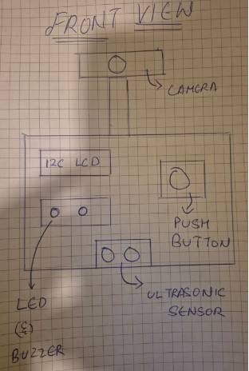
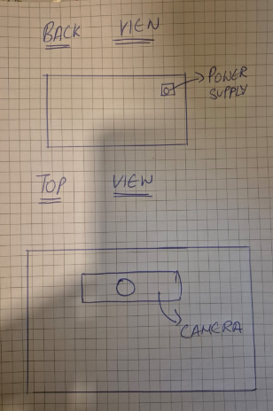
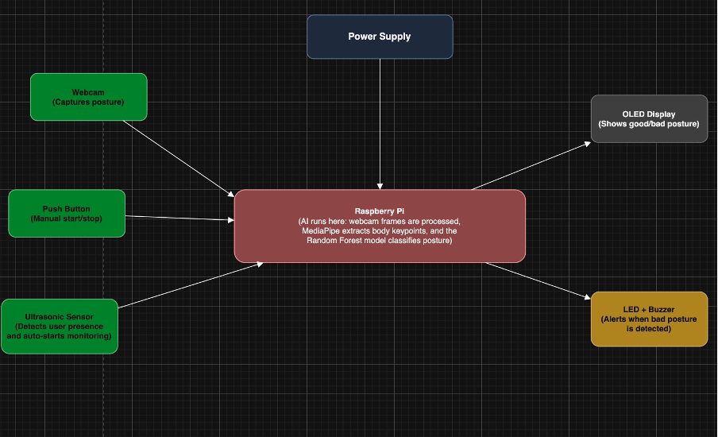

# Project Definition (PD) — P1 CTAI

Fill in every table below, just like you did with the real PD.

---

## 1. Project identity

| Field                | Your answer                                      |
| -------------------- | ------------------------------------------------ |
| **Working title**    | Posture-Pulse                     |
| **Student name**     | Nischeith Ravindra Boddapati                           |
| **Sparring partner** | Thopireddy Yuvan Reddy                              |
| **Project type**     | Keypoint detection|

---

## 2. Concept & impact

| Topic            | Your answer                                              |
| ---------------- | -------------------------------------------------------- |
| **Objective**    | Develop a working AI prototype that detects and corrects unhealthy sitting posture during long study or work sessions. |
| **Target group** | Students, programmers, and office workers who spend long hours sitting at a desk and often develop poor posture without realizing it.                             |
| **Core problem** | Many people sit with poor posture for long periods, which can lead to back pain, neck strain, and long-term spinal health problems.              |
| **Key question** | Can an AI system detect poor sitting posture in real time and provide immediate feedback to help users correct it?                |
| **Impact**       | This system helps users maintain healthier sitting habits by monitoring posture and alerting them when they slouch or lean incorrectly. It can reduce posture-related health problems and improve comfort and productivity during long working or studying sessions.              |

---

## 3. AI & data pipeline

### 3A. Method & data

> **Note:** Standard **image classification only** (single label per image, no boxes/keypoints) is **not allowed**.

| Requirement                    | Your answer                                                                                       |
| ------------------------------ | ------------------------------------------------------------------------------------------------- |
| **Dataset — how & where**      | The dataset will be collected by recording images and videos of people sitting in different posture positions using a webcam connected to a Raspberry Pi or laptop. The MediaPipe model will extract body keypoints such as shoulders, neck, and hips. These keypoints will be stored and used as training data for the posture model. |
| **Classes (min. 4, target 6)** | Good Posture, Slouching, Leaning forward, Leaning sideways,Looking down, Looking up                                                                    |
| **Volume**                     | 600 ≥ 100 annotations **per class** planned (yes/no + rough count per class)                      |

| Class name | Planned # samples / annotations |
| ---------- | ------------------------------- |
| Good Posture           |            100                         |
| Slouching           |           100                     |
| Leaning forward           |        100                         |
| Leaning sideways           |       100                          |
| Looking down           |          100                       |
| Looking up           |          100                       |

### 3B. Training & export

| Project type           | Your choice & model                                                          |
| ---------------------- | ---------------------------------------------------------------------------- |
| **Keypoint detection** |A pretrained MediaPipe model will be used to extract human body key points from camera images (The camera will be placed in a fixed position at shoulder height, approximately 50-100 cm from the user, with a side angle of around 30°–45°. The camera position remains constant for all posture classes, and only the user’s posture changes.). These keypoints will then be used as input features for a machine learning classification model implemented using Python that will classify the user's posture into one of the defined posture classes. The trained classification model will then be exported and deployed on the Raspberry Pi for real-time posture detection.Machine learning classification models:Random forest, Support vector machines(SVM), K nearest neighbour(KNN).|

| Topic                    | Your answer                                                              |
| ------------------------ | ------------------------------------------------------------------------ |
| **Model information**    | [Architecture, input size, where weights live, export format e.g. `.pt`] |
| **Training environment** | [ ] Laptop [ ] RPi [ ] Cloud — details:                                  |
| **Export to RPi**        | [How the trained model reaches `RPi/ai/` or your app]                    |

---

## 4. Hardware & Makerlab plan

### 4A. Mandatory hardware

| Requirement                       | Your implementation                                                  |
| --------------------------------- | -------------------------------------------------------------------- |
| **Headless-first**                | The prototype will operate without a keyboard or mouse connected to the Raspberry Pi. The system can be started or stopped using a physical push button connected to the Raspberry Pi or through the Gradio interface.  |
| **Visual feedback (mandatory)**   | An OLED display will show the current posture status such as good posture, bad posture or sit straight.                                     |
| **Hardware feedback (mandatory)** | A LED provides a visual warning by lighting up when bad posture is detected, while a buzzer emits a sound alert to immediately notify the user to correct their posture.                           |
| **Extra sensor or actuator**      | An ultrasonic sensor detects user presence in front of the system. When a person is within the predefined range (50–100 cm), the posture monitoring system automatically starts, and the camera is activated to begin capturing the user’s posture. |

### 4B. Build quality (Makerlab)

| Criterion            | Your plan                                                      |
| -------------------- | -------------------------------------------------------------- |
| **Housing**          | The system will be built inside a custom laser-cut wooden enclosure that securely houses the Raspberry Pi, OLED display, LED, buzzer, and wiring. The webcam will be mounted on top of the enclosure to clearly capture the user’s sitting posture, while the OLED display, LED, and push button will be placed on the front panel for easy interaction. |

| **Cable management** | All electronic components will be enclosed to prevent accidental contact, with proper openings provided for ventilation and power connections.                          |
| **Safety**           | The enclosure safely protects electronic components and prevents exposed wiring hazards.|
| **Aesthetics**       | The design will be compact, portable, and easy to carry, making the prototype safe, functional, and suitable for presentation.          |

---

## 5. Software & visualisation

### 5A. Gradio interface (mandatory pages)

| Page                   | Content you will show                        |
| ---------------------- | -------------------------------------------- |
| **About & onboarding** | This page will explain the purpose of the posture detection system and provide instructions for users on how to sit correctly and how to use the system.          |
| **Data**               | This page will display posture detection statistics such as the number of good posture detections, bad posture alerts, and sensor readings.      |
| **Operating**          | The user starts or stops posture monitoring using buttons on the interface while the webcam continuously captures the user’s sitting posture. The AI analyzes the camera input in real time and displays the detected posture while triggering alerts such as LEDs or buzzer if bad posture is detected. |
| **Debugging**          | This page will allow testing of hardware components such as LEDs, buzzer, and display directly from the Raspberry Pi.      |

| **Link to kickoff codebase** | [[https://github.com/howest-mct/2025-26-projectone-ctai-BoddapatiNischeith]](https://github.com/howest-mct/2025-26-projectone-ctai-BoddapatiNischeith]) |
| ---------------------------- | --------------------------------------------------------------------------------------------------------------------------------------- |

### 5B. Backend & data

| Component    | Your answer                                                       |
| ------------ | ----------------------------------------------------------------- |
| **Database** | A Docker-deployed database will store the timestamp, posture class, prediction confidence, session ID, ultrasonic sensor presence status, and alert status for each posture event. This allows the system to keep posture history and generate statistics for the Gradio dashboard.                                       |
| **Docker**   | [✔️] Yes      |
| **API**      | Use Python (Gradio and optionally FastAPI) to facilitate communication between the database, AI, and hardware |

---

## 6. System architecture (block diagram)

Paste your diagram below (image or Mermaid). Use these **colours**:

| Colour | Meaning                                  |
| ------ | ---------------------------------------- |
| Red    | Microcontroller (Raspberry Pi) or laptop |
| Green  | Sensors                                  |
| Yellow | Actuators                                |
| Grey   | Display                                  |
| Blue   | Power supply                             |

**Also label:** where AI runs (Pi vs laptop) and what each model does.

